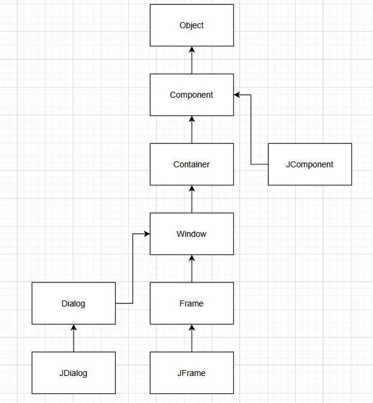
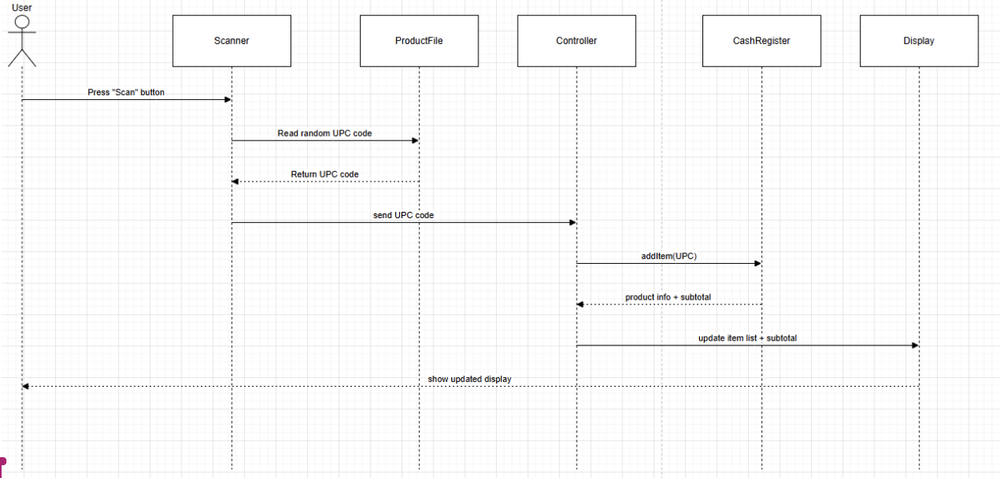

## Work Distribution - Group 30

| Name | Task | 
|---|---|
| Madhav Patel (100820184) | Question 3 | 
| Nathan Tenn (100795860)| Question 1&2 | 
| Edgar Aguilar Guerrero(100823444) | Question 4 | 

## Questions
1. Swing is a GUI toolkit for Java that provides things like buttons, check boxes, trees, lists, and tables.
It was created as an extension of the Abstract Window Toolkit, a similar Java GUI toolkit. Newer, more sophisticated components were needed as programs and UIs evolved, 
and the AWT was too limited. Swing provides more flexible components, is loosely coupled, and makes use of the MVC design pattern unlike AWT.  

2. In the Controller class, some functions directly modify UI elements instead of leaving those to the View class.
For example, saveFirstName(), saveLastName(), and sayHello() all change the JOptionPane directly using information passed from the Model class.
This differs from the typical MVC design pattern by not decoupling some of the classes as the typical MVC pattern does.

3. Code can be found in repository. 

4. 
